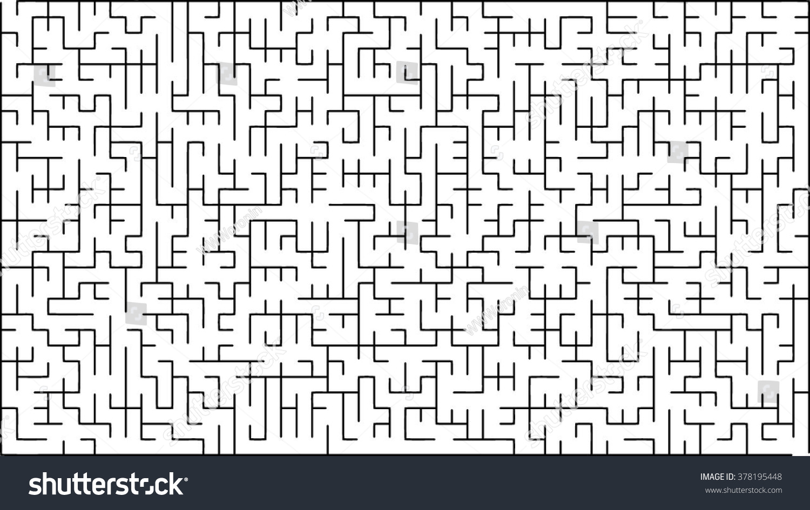

1. 利用变分贝叶斯模型用于识别垃圾邮件和非垃圾邮件，参考数据库：http://www.aueb.gr/users/ion/data/enron-spam/
2. 通过预测用户对电影评级。实验数据库：http://grouplens.org/datasets/movielens/

建议挑小的数据库。

3. 利用分类模型数据分类。数据来源：http://archive.ics.uci.edu/ml/datasets/Iris：1. 数据集自行网上搜索；2. 实现包含SVM、神经网络和集成学习至少三种模型；3. 不同模型的结果与效率进行比较。
4. 利用Reinforcement Learning算法求解迷宫最短路径搜索问题。迷宫图请见附件(maze.jpg；黄色是出发位置)。

要求：任意给出中点位置，规划出最短路径或者告知不能到达。最好给出交互式的界面。

